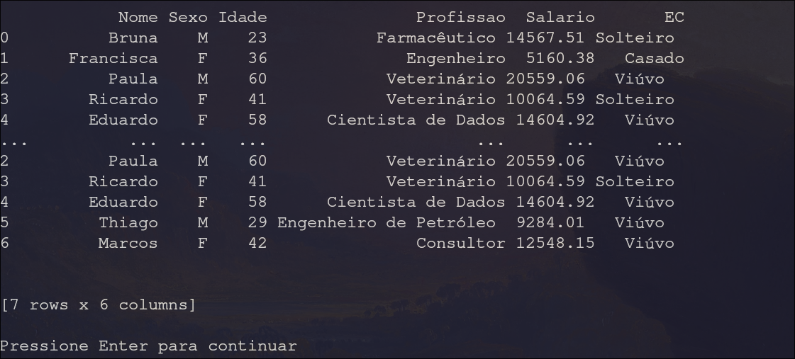

# Leitor de CSV

 Esse projeto é um leitor de CSV feito C que utiliza ponteiros e manipulações diretas de strings. O usuário pode vizualizar os atributos, filtrá-los, ordená-los, salvar mudanças dentre outras features listadas abaixo.

## Funcionalidades


### Sumário
 Mostra os atributos e seus tipos(string ou número).


### Mostrar
 Mostra os primeiros 5 exemplares e os 5 últimos.


### Filtros
 Pede uma atributo e um filtro ( ==, >, <, !=, <=, >=) e mostra os primeiros 5 exemplares e os 5 últimos. É possível salvar a configuração no próprio csv ou em outro arquivo.


### Descrição
 Mostra características de um determinado atributo.


### Ordenação
 Solicita um atributo e ordena o arquivo com base nele em ordem crescente ou descrescente. É possível salvar a configuração no próprio csv ou em outro arquivo.

### Seleção
 Mostra apenas os atributos que forem requisitados pelo programa. É possível salvar a configuração no próprio csv ou em outro arquivo.


### Dados Faltantes
 É possível listar, substituir ou remover valores nulos (NaN). É também possível salvar a configuração no próprio csv ou em outro arquivo.


### Salvar Dados
 Salva o arquivo da maneira em que está.

## Requisitos
 - É necessário que o arquivo lido tenha na sua primeira linha um header com as strings dos atributos separadas por vírgula (,). O tipo de cada atributo é inferido automaticamente.
 - Os elementos devem terminar com uma vírgula(,) com exceção do último da linha.

## Uso
```bash
make
./csvreader <<arquivo.csv>>
```


